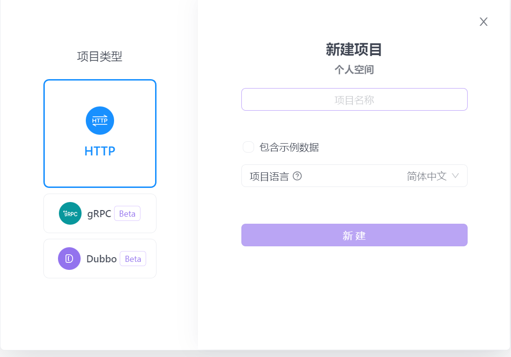

**通过apifox随便创建一个项目**

名字随便起

创建一个快捷请求

填入带有规则的链接

得到参数

在url中加入机场节点链接
    如果是多个机场的链接需要在中间加  |     例如：第一个链接|第二个链接

filename中是配置名称  可以随意更改
    比如我在这填的LLL，clash中也是LLL

其他参数无需更改直接点击发送请求

等待后在最下面选择实际请求

点击复制链接就可以了
